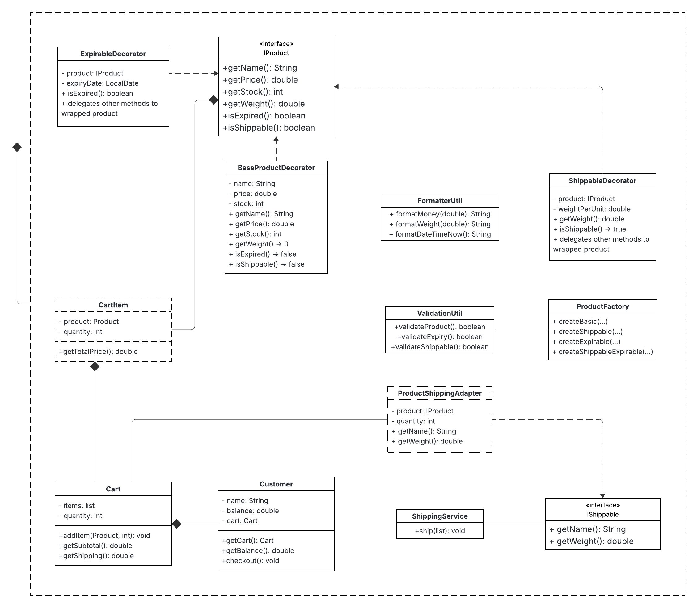
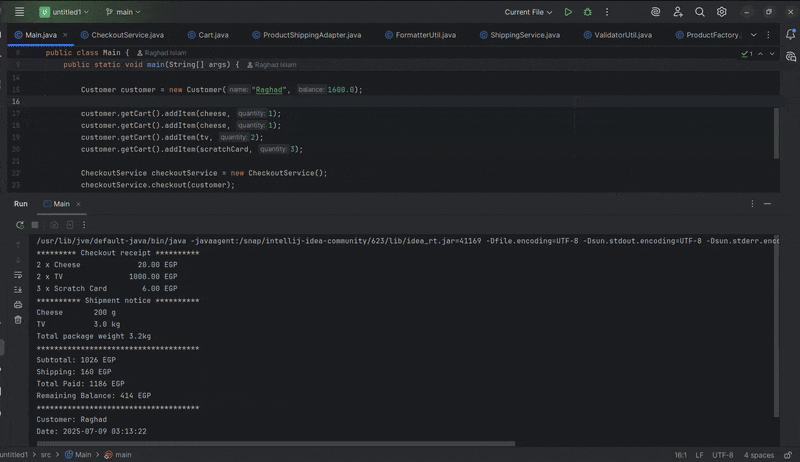
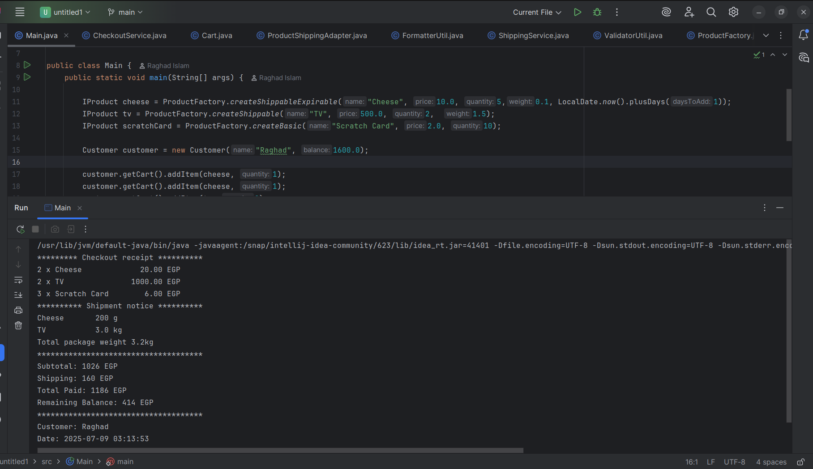

# 🛒 E-Commerce System – Java OOP Design

This is a fully modular and extensible Java-based console application that simulates an e-commerce system. It allows customers to add products to a cart, perform checkout with inventory and balance validation, apply shipping logic, and print formatted receipts.

---

## 📦 Features

- Add products with attributes like name, price, quantity, expiry, and weight
- Differentiate between:
  - Expirable vs. Non-expirable products
  - Shippable vs. Non-shippable products
- Customer with balance and cart
- Cart handles item merging and subtotal calculation
- ShippingService that prints grouped shipment details with calculated weights
- Receipt printing with customer name and checkout date
- Validation utilities and custom exception handling
- Designed with clean architecture and SOLID principles

---

## 🎨 Design Patterns Used

| Pattern              | Purpose                                         |
| -------------------- | ----------------------------------------------- |
| **Factory**          | Creates products with optional behavior         |
| **Decorator**        | Dynamically adds shipping or expiry behavior    |
| **Adapter**          | Converts product to a `ShippingItem`            |
| **Strategy (Ready)** | For future use in shipping or discount policies |

---

## 🧠 Example Output

---

## 🧱 Project Structure

```
src/
├── Adapters/
│ └── ProductShippingAdapter.java
├── Decorators/
│ ├── BaseProductDecorator.java
│ ├── ExpirableDecorator.java
│ └── ShippableDecorator.java
├── Factories/
│ └── ProductFactory.java
├── Interface/
│ ├── IProduct.java
│ └── IShippable.java
├── Model/
│ ├── CartItem.java
│ ├── Customer.java
│ └── ProductType.java
├── Service/
│ ├── Cart.java
│ ├── CheckoutService.java
│ └── ShippingService.java
├── Utils/
│ ├── FormatterUtil.java
│ └── ValidationUtil.java
└── Main.java
```

---

## Example Input

In `Main.java`:

```java
IProduct cheese = ProductFactory.createShippableExpirable("Cheese", 10.0, 5,0.1, LocalDate.now().plusDays(1));
IProduct tv = ProductFactory.createShippable("TV", 500.0, 2,  1.5);
IProduct scratchCard = ProductFactory.createBasic("Scratch Card", 2.0, 10);

Customer customer = new Customer("Raghad", 1600.0);

customer.getCart().addItem(cheese, 1);
customer.getCart().addItem(cheese, 1);
customer.getCart().addItem(tv, 2);
customer.getCart().addItem(scratchCard, 3);

CheckoutService checkoutService = new CheckoutService();
checkoutService.checkout(customer);

```

## Output

In `Main.java`:

```
********* Checkout receipt **********
2 x Cheese             20.00 EGP
2 x TV               1000.00 EGP
3 x Scratch Card        6.00 EGP
********** Shipment notice **********
Cheese       200 g
TV           3.0 kg
Total package weight 3.2kg
*************************************
Subtotal: 1026 EGP
Shipping: 160 EGP
Total Paid: 1186 EGP
Remaining Balance: 414 EGP
*************************************
Customer: Raghad
Date: 2025-07-05 17:51:57
```

---

## How to Run

1. **Clone the project**
   ```bash
   git clone https://github.com/raghadislam/Fawry-Rise-Journey---E-Commerce-System-Challenge.git
   cd Fawry-Rise-Journey---E-Commerce-System-Challenge.git
   ```
2. **Compile**

```bash
javac -d bin src/**/*.java
```

3. **Run**

```bash
java -cp bin Main
```

Or run via your IDE (IntelliJ, Eclipse).

## 📊 UML Class Diagram




## Demo


## Output Screenshot

